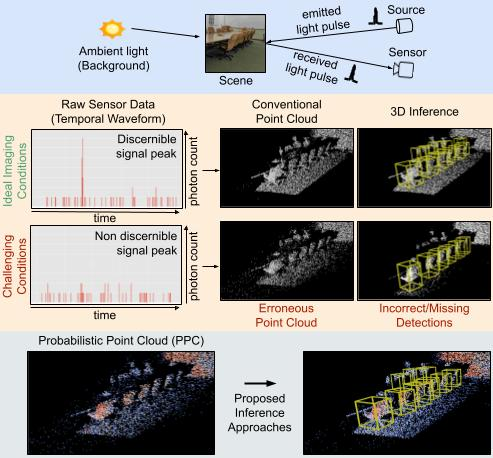

## Robust 3D Object Detection using Probabilistic Point Clouds from Single-Photon LiDARs

**ICCV 2025** <br> [PDF](https://drive.google.com/file/d/1ErBsG4QKFJozsgoB9cveZU7j2PgNchWp) &nbsp; [Project](https://bhavyagoyal.github.io/ppc)



#### [Bhavya Goyal](https://bhavyagoyal.github.io), [Felipe Gutierrez-Barragan](https://pages.cs.wisc.edu/~felipe/), [Wei Lin](https://www.linkedin.com/in/wei-lin-31a437108), [Andreas Velten](https://biostat.wisc.edu/~velten/), [Yin Li](https://www.biostat.wisc.edu/~yli/), [Mohit Gupta](https://wisionlab.cs.wisc.edu/people/mohit-gupta/)
University of Wisconsin-Madison


### Abstract
LiDAR-based 3D sensors provide point clouds, a canonical 3D representation used in various scene understanding tasks. Modern LiDARs face key challenges in several real-world scenarios, such as long-distance or low-albedo objects, producing sparse or erroneous point clouds. These errors, which are rooted in the noisy raw LiDAR measurements, get propagated to downstream perception models, resulting in potentially severe loss of accuracy.
This is because conventional 3D processing pipelines do not retain any uncertainty information from the raw measurements when constructing point clouds.

We propose Probabilistic Point Clouds (PPC), a novel 3D scene representation where each point is augmented with a probability attribute that encapsulates the measurement uncertainty (or confidence) in the raw data. We further introduce inference approaches that leverage PPC for robust 3D object detection; these methods are versatile and can be used as computationally lightweight drop-in modules in 3D inference pipelines. We demonstrate, via both simulations and real captures, that PPC-based 3D inference methods outperform several baselines using LiDAR as well as camera-LiDAR fusion models, across challenging indoor and outdoor scenarios involving small, distant, and low-albedo objects, as well as strong ambient light.


### Code Structure
```bash
.                                  # MMdetection3d Code
.
.
├── tools/ppc_simulation/          # Code for Probabilistic Point Cloud Simulation
└── README.md
```


### Requirements/Installation
- Follow the [Installation](https://mmdetection3d.readthedocs.io/en/latest/get_started.html) steps for mmdetection3d framework.
- `matlab` is required for PPC simulation.


### Probabilistic Point Cloud (PPC) Simulation
- Follow the original dataset [instructions](https://mmdetection3d.readthedocs.io/en/latest/user_guides/dataset_prepare.html) to prepare clean point cloud dataset.
- Use `ppc_simulate.sh` to simulate 3D temporal waveforms.
```bash
cd tools/ppc_simulation
./ppc_simulate.sh 0 10
```

- Use `gen_points.sh` to create probabilistic point clouds from the 3D waveforms.
```bash
./gen_points.sh 0 10
```

- Use `create_pkl.py` to create label files for the whole dataset. It also creates a copy of clean point clouds to create ppc with probability 1.
```bash
python create_pkl.py
```
Edit the `dataset` field in the scripts to simulate for `KITTI` dataset. Increase 10 to the size of the dataset to simulate all scenes.


### Training/Evaluating PPC models
- Train PPC model using `ppc_train.sh` script. Uncomment lines in the script to train all PPC models and baselines.
```bash
./ppc_train.sh
```

- Evaluate PPC model using `ppc_test.sh` script.
```bash
./ppc_test.sh
```


### Results/Models

#### SUN RGB-D

|   Method           |          |          |  AP@25    |          |          |       Download      |
|-------------------:|:--------:|:--------:|:---------:|:--------:|:--------:|:-------------------:|
|                    |  *Clean* |    *0.1* |   *0.05*  |  *0.02*  |   *0.01* |                     |
|  Matched Filtering |   51.34  |   42.43  |   38.77   |  16.95   |   11.34  | [model](https://drive.google.com/file/d/1o_ADaNoi0Ws9a-2Lv7yFDQKHOakV-R0p/view?usp=sharing) \| [log](https://drive.google.com/file/d/1OkUKU9Tae6hF2kVSHcWVlU3YZH66P3gl/view?usp=sharing)|
|  Thresholding      |   57.11  |   51.27  |   46.44   |  29.58   |   16.47  | [model](https://drive.google.com/file/d/1LznG5jQZf_fAqyQJa6WvuyEzAsX0x-8j/view?usp=sharing) \| [log](https://drive.google.com/file/d/12rsry3ZbKyFZy9oXyXBcThLYHzYRTzzd/view?usp=sharing)|
|  **PPC**           | **58.61**| **54.29**| **52.46** |**38.49** | **29.42**| [model](https://drive.google.com/file/d/1AQ7r7k5UhbCmJpElhzA7NuKGJadN0n-E/view?usp=sharing) \| [log](https://drive.google.com/file/d/1Us8nX_4eYWnlkIJIhy9oswhQpxfHqBtK/view?usp=sharing)|

#### KITTI

##### Pedestrian mAP for PV-RCNN (3 class) model. Evaluated on KITTI val split using 11 recall positions for moderate difficulty

|   Method           |          |          |    mAP    |          |          |       Download      |
|-------------------:|:--------:|:--------:|:---------:|:--------:|:--------:|:-------------------:|
|                    |  *Clean* |   *0.05* |   *0.02*  |  *0.01*  | *0.005*  |                     |
|  Matched Filtering |   60.11  |   55.76  |   50.03   |  47.06   |   37.01  | [model](https://drive.google.com/file/d/1B8V3Dk4LTZEOIRjmLxymx2wRQT5M0uA4/view?usp=sharing) \| [log](https://drive.google.com/file/d/1gvC2EpiVNgzMcfOTn-TGmDeR_ch8zapb/view?usp=sharing)|
|  Thresholding      |   58.63  |   57.72  |   54.80   |  49.23   |   38.62  | [model](https://drive.google.com/file/d/1LllqAZePuE8OwW-IdWgp9gdsnyBQZwau/view?usp=sharing) \| [log](https://drive.google.com/file/d/1B8MpaE8utVS829ZfShgCN6ANJ8HsMxDe/view?usp=sharing)|
|  **PPC**           | **60.62**| **59.12**| **59.04** |**55.39** | **49.51**| [model](https://drive.google.com/file/d/1lU8cJ35a_kRzn2bVNab-DfeYigYMZxrp/view?usp=sharing) \| [log](https://drive.google.com/file/d/1-taW8VtjkJ5HiXcbNnH2MjtBt9_k2mmT/view?usp=sharing)|

<!---

##### Cyclist (3 class model)

|   Method           |          |          |    mAP    |          |          |       Download      |
|-------------------:|:--------:|:--------:|:---------:|:--------:|:--------:|:-------------------:|
|                    |  *Clean* |   *0.05* |   *0.02*  |  *0.01*  | *0.005*  |                     |
|  Matched Filtering |   71.11  |   63.31  |   57.25   |  50.25   |   40.90  | [model]() \| [log]()|
|  Thresholding      |   70.66  |   63.65  |   58.52   |  51.20   |   41.57  | [model]() \| [log]()|
|  [PPC]()           | **71.31**| **64.56**| **59.38** |**53.11** | **45.33**| [model]() \| [log]()|

-->

<!-- Model weights will be updated soon. -->


<div align="center">
  
  <div>&nbsp;</div>
  <div align="center">
    <b><font size="5">OpenMMLab website</font></b>
    <sup>
      <a href="https://openmmlab.com">
        <i><font size="4">HOT</font></i>
      </a>
    </sup>
    &nbsp;&nbsp;&nbsp;&nbsp;
    <b><font size="5">OpenMMLab platform</font></b>
    <sup>
      <a href="https://platform.openmmlab.com">
        <i><font size="4">TRY IT OUT</font></i>
      </a>
    </sup>
  </div>
  <div>&nbsp;</div>

[](https://pypi.org/project/mmdet3d)
[](https://mmdetection3d.readthedocs.io/en/latest/)
[](https://github.com/open-mmlab/mmdetection3d/actions)
[](https://codecov.io/gh/open-mmlab/mmdetection3d)
[](https://github.com/open-mmlab/mmdetection3d/blob/main/LICENSE)
[](https://github.com/open-mmlab/mmdetection3d/issues)
[](https://github.com/open-mmlab/mmdetection3d/issues)

[📘Documentation](https://mmdetection3d.readthedocs.io/en/latest/) |
[🛠️Installation](https://mmdetection3d.readthedocs.io/en/latest/get_started.html) |
[👀Model Zoo](https://mmdetection3d.readthedocs.io/en/latest/model_zoo.html) |
[🆕Update News](https://mmdetection3d.readthedocs.io/en/latest/notes/changelog.html) |
[🚀Ongoing Projects](https://github.com/open-mmlab/mmdetection3d/projects) |
[🤔Reporting Issues](https://github.com/open-mmlab/mmdetection3d/issues/new/choose)

</div>

<div align="center">

English | [简体中文](README_zh-CN.md)

</div>

<div align="center">
  <a href="https://openmmlab.medium.com/" style="text-decoration:none;">
    </a>
  
  <a href="https://discord.com/channels/1037617289144569886/1046608014234370059" style="text-decoration:none;">
    </a>
  
  <a href="https://twitter.com/OpenMMLab" style="text-decoration:none;">
    </a>
  
  <a href="https://www.youtube.com/openmmlab" style="text-decoration:none;">
    </a>
  
  <a href="https://space.bilibili.com/1293512903" style="text-decoration:none;">
    </a>
  
  <a href="https://www.zhihu.com/people/openmmlab" style="text-decoration:none;">
    </a>
</div>

## Introduction

MMDetection3D is an open source object detection toolbox based on PyTorch, towards the next-generation platform for general 3D detection. It is a part of the [OpenMMLab](https://openmmlab.com/) project.

The main branch works with **PyTorch 1.8+**.


<details open>
<summary>Major features</summary>

- **Support multi-modality/single-modality detectors out of box**

  It directly supports multi-modality/single-modality detectors including MVXNet, VoteNet, PointPillars, etc.

- **Support indoor/outdoor 3D detection out of box**

  It directly supports popular indoor and outdoor 3D detection datasets, including ScanNet, SUNRGB-D, Waymo, nuScenes, Lyft, and KITTI. For nuScenes dataset, we also support [nuImages dataset](https://github.com/open-mmlab/mmdetection3d/tree/main/configs/nuimages).

- **Natural integration with 2D detection**

  All the about **300+ models, methods of 40+ papers**, and modules supported in [MMDetection](https://github.com/open-mmlab/mmdetection/blob/3.x/docs/en/model_zoo.md) can be trained or used in this codebase.

- **High efficiency**

  It trains faster than other codebases. The main results are as below. Details can be found in [benchmark.md](./docs/en/notes/benchmarks.md). We compare the number of samples trained per second (the higher, the better). The models that are not supported by other codebases are marked by `✗`.

  |       Methods       | MMDetection3D | [OpenPCDet](https://github.com/open-mmlab/OpenPCDet) | [votenet](https://github.com/facebookresearch/votenet) | [Det3D](https://github.com/poodarchu/Det3D) |
  | :-----------------: | :-----------: | :--------------------------------------------------: | :----------------------------------------------------: | :-----------------------------------------: |
  |       VoteNet       |      358      |                          ✗                           |                           77                           |                      ✗                      |
  |  PointPillars-car   |      141      |                          ✗                           |                           ✗                            |                     140                     |
  | PointPillars-3class |      107      |                          44                          |                           ✗                            |                      ✗                      |
  |       SECOND        |      40       |                          30                          |                           ✗                            |                      ✗                      |
  |       Part-A2       |      17       |                          14                          |                           ✗                            |                      ✗                      |

</details>

Like [MMDetection](https://github.com/open-mmlab/mmdetection) and [MMCV](https://github.com/open-mmlab/mmcv), MMDetection3D can also be used as a library to support different projects on top of it.

## What's New

### Highlight

In version 1.4, MMDetecion3D refactors the Waymo dataset and accelerates the preprocessing, training/testing setup, and evaluation of Waymo dataset. We also extends the support for camera-based, such as Monocular and BEV, 3D object detection models on Waymo. A detailed description of the Waymo data information is provided [here](https://mmdetection3d.readthedocs.io/en/latest/advanced_guides/datasets/waymo.html).

Besides, in version 1.4, MMDetection3D provides [Waymo-mini](https://download.openmmlab.com/mmdetection3d/data/waymo_mmdet3d_after_1x4/waymo_mini.tar.gz) to help community users get started with Waymo and use it for quick iterative development.

**v1.4.0** was released in 8/1/2024：

- Support the training of [DSVT](<(https://arxiv.org/abs/2301.06051)>) in `projects`
- Support [Nerf-Det](https://arxiv.org/abs/2307.14620) in `projects`
- Refactor Waymo dataset

**v1.3.0** was released in 18/10/2023:

- Support [CENet](https://arxiv.org/abs/2207.12691) in `projects`
- Enhance demos with new 3D inferencers

**v1.2.0** was released in 4/7/2023

- Support [New Config Type](https://mmengine.readthedocs.io/en/latest/advanced_tutorials/config.html#a-pure-python-style-configuration-file-beta) in `mmdet3d/configs`
- Support the inference of [DSVT](<(https://arxiv.org/abs/2301.06051)>) in `projects`
- Support downloading datasets from [OpenDataLab](https://opendatalab.com/) using `mim`

**v1.1.1** was released in 30/5/2023:

- Support [TPVFormer](https://arxiv.org/pdf/2302.07817.pdf) in `projects`
- Support the training of BEVFusion in `projects`
- Support lidar-based 3D semantic segmentation benchmark

## Installation

Please refer to [Installation](https://mmdetection3d.readthedocs.io/en/latest/get_started.html) for installation instructions.

## Getting Started

For detailed user guides and advanced guides, please refer to our [documentation](https://mmdetection3d.readthedocs.io/en/latest/):

<details>
<summary>User Guides</summary>

- [Train & Test](https://mmdetection3d.readthedocs.io/en/latest/user_guides/index.html#train-test)
  - [Learn about Configs](https://mmdetection3d.readthedocs.io/en/latest/user_guides/config.html)
  - [Coordinate System](https://mmdetection3d.readthedocs.io/en/latest/user_guides/coord_sys_tutorial.html)
  - [Dataset Preparation](https://mmdetection3d.readthedocs.io/en/latest/user_guides/dataset_prepare.html)
  - [Customize Data Pipelines](https://mmdetection3d.readthedocs.io/en/latest/user_guides/data_pipeline.html)
  - [Test and Train on Standard Datasets](https://mmdetection3d.readthedocs.io/en/latest/user_guides/train_test.html)
  - [Inference](https://mmdetection3d.readthedocs.io/en/latest/user_guides/inference.html)
  - [Train with Customized Datasets](https://mmdetection3d.readthedocs.io/en/latest/user_guides/new_data_model.html)
- [Useful Tools](https://mmdetection3d.readthedocs.io/en/latest/user_guides/index.html#useful-tools)

</details>

<details>
<summary>Advanced Guides</summary>

- [Datasets](https://mmdetection3d.readthedocs.io/en/latest/advanced_guides/index.html#datasets)
  - [KITTI Dataset](https://mmdetection3d.readthedocs.io/en/latest/advanced_guides/datasets/kitti.html)
  - [NuScenes Dataset](https://mmdetection3d.readthedocs.io/en/latest/advanced_guides/datasets/nuscenes.html)
  - [Lyft Dataset](https://mmdetection3d.readthedocs.io/en/latest/advanced_guides/datasets/lyft.html)
  - [Waymo Dataset](https://mmdetection3d.readthedocs.io/en/latest/advanced_guides/datasets/waymo.html)
  - [SUN RGB-D Dataset](https://mmdetection3d.readthedocs.io/en/latest/advanced_guides/datasets/sunrgbd.html)
  - [ScanNet Dataset](https://mmdetection3d.readthedocs.io/en/latest/advanced_guides/datasets/scannet.html)
  - [S3DIS Dataset](https://mmdetection3d.readthedocs.io/en/latest/advanced_guides/datasets/s3dis.html)
  - [SemanticKITTI Dataset](https://mmdetection3d.readthedocs.io/en/latest/advanced_guides/datasets/semantickitti.html)
- [Supported Tasks](https://mmdetection3d.readthedocs.io/en/latest/advanced_guides/index.html#supported-tasks)
  - [LiDAR-Based 3D Detection](https://mmdetection3d.readthedocs.io/en/latest/advanced_guides/supported_tasks/lidar_det3d.html)
  - [Vision-Based 3D Detection](https://mmdetection3d.readthedocs.io/en/latest/advanced_guides/supported_tasks/vision_det3d.html)
  - [LiDAR-Based 3D Semantic Segmentation](https://mmdetection3d.readthedocs.io/en/latest/advanced_guides/supported_tasks/lidar_sem_seg3d.html)
- [Customization](https://mmdetection3d.readthedocs.io/en/latest/advanced_guides/index.html#customization)
  - [Customize Datasets](https://mmdetection3d.readthedocs.io/en/latest/advanced_guides/customize_dataset.html)
  - [Customize Models](https://mmdetection3d.readthedocs.io/en/latest/advanced_guides/customize_models.html)
  - [Customize Runtime Settings](https://mmdetection3d.readthedocs.io/en/latest/advanced_guides/customize_runtime.html)

</details>

## Overview of Benchmark and Model Zoo

Results and models are available in the [model zoo](docs/en/model_zoo.md).

<div align="center">
  <b>Components</b>
</div>
<table align="center">
  <tbody>
    <tr align="center" valign="bottom">
      <td>
        <b>Backbones</b>
      </td>
      <td>
        <b>Heads</b>
      </td>
      <td>
        <b>Features</b>
      </td>
    </tr>
    <tr valign="top">
      <td>
      <ul>
        <li><a href="configs/pointnet2">PointNet (CVPR'2017)</a></li>
        <li><a href="configs/pointnet2">PointNet++ (NeurIPS'2017)</a></li>
        <li><a href="configs/regnet">RegNet (CVPR'2020)</a></li>
        <li><a href="configs/dgcnn">DGCNN (TOG'2019)</a></li>
        <li>DLA (CVPR'2018)</li>
        <li>MinkResNet (CVPR'2019)</li>
        <li><a href="configs/minkunet">MinkUNet (CVPR'2019)</a></li>
        <li><a href="configs/cylinder3d">Cylinder3D (CVPR'2021)</a></li>
      </ul>
      </td>
      <td>
      <ul>
        <li><a href="configs/free_anchor">FreeAnchor (NeurIPS'2019)</a></li>
      </ul>
      </td>
      <td>
      <ul>
        <li><a href="configs/dynamic_voxelization">Dynamic Voxelization (CoRL'2019)</a></li>
      </ul>
      </td>
    </tr>
</td>
    </tr>
  </tbody>
</table>

<div align="center">
  <b>Architectures</b>
</div>
<table align="center">
  <tbody>
    <tr align="center" valign="middle">
      <td>
        <b>LiDAR-based 3D Object Detection</b>
      </td>
      <td>
        <b>Camera-based 3D Object Detection</b>
      </td>
      <td>
        <b>Multi-modal 3D Object Detection</b>
      </td>
      <td>
        <b>3D Semantic Segmentation</b>
      </td>
    </tr>
    <tr valign="top">
      <td>
        <li><b>Outdoor</b></li>
        <ul>
            <li><a href="configs/second">SECOND (Sensor'2018)</a></li>
            <li><a href="configs/pointpillars">PointPillars (CVPR'2019)</a></li>
            <li><a href="configs/ssn">SSN (ECCV'2020)</a></li>
            <li><a href="configs/3dssd">3DSSD (CVPR'2020)</a></li>
            <li><a href="configs/sassd">SA-SSD (CVPR'2020)</a></li>
            <li><a href="configs/point_rcnn">PointRCNN (CVPR'2019)</a></li>
            <li><a href="configs/parta2">Part-A2 (TPAMI'2020)</a></li>
            <li><a href="configs/centerpoint">CenterPoint (CVPR'2021)</a></li>
            <li><a href="configs/pv_rcnn">PV-RCNN (CVPR'2020)</a></li>
            <li><a href="projects/CenterFormer">CenterFormer (ECCV'2022)</a></li>
        </ul>
        <li><b>Indoor</b></li>
        <ul>
            <li><a href="configs/votenet">VoteNet (ICCV'2019)</a></li>
            <li><a href="configs/h3dnet">H3DNet (ECCV'2020)</a></li>
            <li><a href="configs/groupfree3d">Group-Free-3D (ICCV'2021)</a></li>
            <li><a href="configs/fcaf3d">FCAF3D (ECCV'2022)</a></li>
            <li><a href="projects/TR3D">TR3D (ArXiv'2023)</a></li>
      </ul>
      </td>
      <td>
        <li><b>Outdoor</b></li>
        <ul>
          <li><a href="configs/imvoxelnet">ImVoxelNet (WACV'2022)</a></li>
          <li><a href="configs/smoke">SMOKE (CVPRW'2020)</a></li>
          <li><a href="configs/fcos3d">FCOS3D (ICCVW'2021)</a></li>
          <li><a href="configs/pgd">PGD (CoRL'2021)</a></li>
          <li><a href="configs/monoflex">MonoFlex (CVPR'2021)</a></li>
          <li><a href="projects/DETR3D">DETR3D (CoRL'2021)</a></li>
          <li><a href="projects/PETR">PETR (ECCV'2022)</a></li>
        </ul>
        <li><b>Indoor</b></li>
        <ul>
          <li><a href="configs/imvoxelnet">ImVoxelNet (WACV'2022)</a></li>
        </ul>
      </td>
      <td>
        <li><b>Outdoor</b></li>
        <ul>
          <li><a href="configs/mvxnet">MVXNet (ICRA'2019)</a></li>
          <li><a href="projects/BEVFusion">BEVFusion (ICRA'2023)</a></li>
        </ul>
        <li><b>Indoor</b></li>
        <ul>
          <li><a href="configs/imvotenet">ImVoteNet (CVPR'2020)</a></li>
        </ul>
      </td>
      <td>
        <li><b>Outdoor</b></li>
        <ul>
          <li><a href="configs/minkunet">MinkUNet (CVPR'2019)</a></li>
          <li><a href="configs/spvcnn">SPVCNN (ECCV'2020)</a></li>
          <li><a href="configs/cylinder3d">Cylinder3D (CVPR'2021)</a></li>
          <li><a href="projects/TPVFormer">TPVFormer (CVPR'2023)</a></li>
        </ul>
        <li><b>Indoor</b></li>
        <ul>
          <li><a href="configs/pointnet2">PointNet++ (NeurIPS'2017)</a></li>
          <li><a href="configs/paconv">PAConv (CVPR'2021)</a></li>
          <li><a href="configs/dgcnn">DGCNN (TOG'2019)</a></li>
        </ul>
      </ul>
      </td>
    </tr>
</td>
    </tr>
  </tbody>
</table>

|               | ResNet | VoVNet | Swin-T | PointNet++ | SECOND | DGCNN | RegNetX | DLA | MinkResNet | Cylinder3D | MinkUNet |
| :-----------: | :----: | :----: | :----: | :--------: | :----: | :---: | :-----: | :-: | :--------: | :--------: | :------: |
|    SECOND     |   ✗    |   ✗    |   ✗    |     ✗      |   ✓    |   ✗   |    ✗    |  ✗  |     ✗      |     ✗      |    ✗     |
| PointPillars  |   ✗    |   ✗    |   ✗    |     ✗      |   ✓    |   ✗   |    ✓    |  ✗  |     ✗      |     ✗      |    ✗     |
|  FreeAnchor   |   ✗    |   ✗    |   ✗    |     ✗      |   ✗    |   ✗   |    ✓    |  ✗  |     ✗      |     ✗      |    ✗     |
|    VoteNet    |   ✗    |   ✗    |   ✗    |     ✓      |   ✗    |   ✗   |    ✗    |  ✗  |     ✗      |     ✗      |    ✗     |
|    H3DNet     |   ✗    |   ✗    |   ✗    |     ✓      |   ✗    |   ✗   |    ✗    |  ✗  |     ✗      |     ✗      |    ✗     |
|     3DSSD     |   ✗    |   ✗    |   ✗    |     ✓      |   ✗    |   ✗   |    ✗    |  ✗  |     ✗      |     ✗      |    ✗     |
|    Part-A2    |   ✗    |   ✗    |   ✗    |     ✗      |   ✓    |   ✗   |    ✗    |  ✗  |     ✗      |     ✗      |    ✗     |
|    MVXNet     |   ✓    |   ✗    |   ✗    |     ✗      |   ✓    |   ✗   |    ✗    |  ✗  |     ✗      |     ✗      |    ✗     |
|  CenterPoint  |   ✗    |   ✗    |   ✗    |     ✗      |   ✓    |   ✗   |    ✗    |  ✗  |     ✗      |     ✗      |    ✗     |
|      SSN      |   ✗    |   ✗    |   ✗    |     ✗      |   ✗    |   ✗   |    ✓    |  ✗  |     ✗      |     ✗      |    ✗     |
|   ImVoteNet   |   ✓    |   ✗    |   ✗    |     ✓      |   ✗    |   ✗   |    ✗    |  ✗  |     ✗      |     ✗      |    ✗     |
|    FCOS3D     |   ✓    |   ✗    |   ✗    |     ✗      |   ✗    |   ✗   |    ✗    |  ✗  |     ✗      |     ✗      |    ✗     |
|  PointNet++   |   ✗    |   ✗    |   ✗    |     ✓      |   ✗    |   ✗   |    ✗    |  ✗  |     ✗      |     ✗      |    ✗     |
| Group-Free-3D |   ✗    |   ✗    |   ✗    |     ✓      |   ✗    |   ✗   |    ✗    |  ✗  |     ✗      |     ✗      |    ✗     |
|  ImVoxelNet   |   ✓    |   ✗    |   ✗    |     ✗      |   ✗    |   ✗   |    ✗    |  ✗  |     ✗      |     ✗      |    ✗     |
|    PAConv     |   ✗    |   ✗    |   ✗    |     ✓      |   ✗    |   ✗   |    ✗    |  ✗  |     ✗      |     ✗      |    ✗     |
|     DGCNN     |   ✗    |   ✗    |   ✗    |     ✗      |   ✗    |   ✓   |    ✗    |  ✗  |     ✗      |     ✗      |    ✗     |
|     SMOKE     |   ✗    |   ✗    |   ✗    |     ✗      |   ✗    |   ✗   |    ✗    |  ✓  |     ✗      |     ✗      |    ✗     |
|      PGD      |   ✓    |   ✗    |   ✗    |     ✗      |   ✗    |   ✗   |    ✗    |  ✗  |     ✗      |     ✗      |    ✗     |
|   MonoFlex    |   ✗    |   ✗    |   ✗    |     ✗      |   ✗    |   ✗   |    ✗    |  ✓  |     ✗      |     ✗      |    ✗     |
|    SA-SSD     |   ✗    |   ✗    |   ✗    |     ✗      |   ✓    |   ✗   |    ✗    |  ✗  |     ✗      |     ✗      |    ✗     |
|    FCAF3D     |   ✗    |   ✗    |   ✗    |     ✗      |   ✗    |   ✗   |    ✗    |  ✗  |     ✓      |     ✗      |    ✗     |
|    PV-RCNN    |   ✗    |   ✗    |   ✗    |     ✗      |   ✓    |   ✗   |    ✗    |  ✗  |     ✗      |     ✗      |    ✗     |
|  Cylinder3D   |   ✗    |   ✗    |   ✗    |     ✗      |   ✗    |   ✗   |    ✗    |  ✗  |     ✗      |     ✓      |    ✗     |
|   MinkUNet    |   ✗    |   ✗    |   ✗    |     ✗      |   ✗    |   ✗   |    ✗    |  ✗  |     ✗      |     ✗      |    ✓     |
|    SPVCNN     |   ✗    |   ✗    |   ✗    |     ✗      |   ✗    |   ✗   |    ✗    |  ✗  |     ✗      |     ✗      |    ✓     |
|   BEVFusion   |   ✗    |   ✗    |   ✓    |     ✗      |   ✓    |   ✗   |    ✗    |  ✗  |     ✗      |     ✗      |    ✗     |
| CenterFormer  |   ✗    |   ✗    |   ✗    |     ✗      |   ✓    |   ✗   |    ✗    |  ✗  |     ✗      |     ✗      |    ✗     |
|     TR3D      |   ✗    |   ✗    |   ✗    |     ✗      |   ✗    |   ✗   |    ✗    |  ✗  |     ✓      |     ✗      |    ✗     |
|    DETR3D     |   ✓    |   ✓    |   ✗    |     ✗      |   ✗    |   ✗   |    ✗    |  ✗  |     ✗      |     ✗      |    ✗     |
|     PETR      |   ✗    |   ✓    |   ✗    |     ✗      |   ✗    |   ✗   |    ✗    |  ✗  |     ✗      |     ✗      |    ✗     |
|   TPVFormer   |   ✓    |   ✗    |   ✗    |     ✗      |   ✗    |   ✗   |    ✗    |  ✗  |     ✗      |     ✗      |    ✗     |

**Note:** All the about **500+ models, methods of 90+ papers** in 2D detection supported by [MMDetection](https://github.com/open-mmlab/mmdetection/blob/3.x/docs/en/model_zoo.md) can be trained or used in this codebase.

## FAQ

Please refer to [FAQ](docs/en/notes/faq.md) for frequently asked questions.

## Contributing

We appreciate all contributions to improve MMDetection3D. Please refer to [CONTRIBUTING.md](docs/en/notes/contribution_guides.md) for the contributing guideline.

## Acknowledgement

MMDetection3D is an open source project that is contributed by researchers and engineers from various colleges and companies. We appreciate all the contributors as well as users who give valuable feedbacks. We wish that the toolbox and benchmark could serve the growing research community by providing a flexible toolkit to reimplement existing methods and develop their own new 3D detectors.

## Citation

If you find this project useful in your research, please consider cite:

```latex
@misc{mmdet3d2020,
    title={{MMDetection3D: OpenMMLab} next-generation platform for general {3D} object detection},
    author={MMDetection3D Contributors},
    howpublished = {\url{https://github.com/open-mmlab/mmdetection3d}},
    year={2020}
}
```

## License

This project is released under the [Apache 2.0 license](LICENSE).

## Projects in OpenMMLab

- [MMEngine](https://github.com/open-mmlab/mmengine): OpenMMLab foundational library for training deep learning models.
- [MMCV](https://github.com/open-mmlab/mmcv): OpenMMLab foundational library for computer vision.
- [MMEval](https://github.com/open-mmlab/mmeval): A unified evaluation library for multiple machine learning libraries.
- [MIM](https://github.com/open-mmlab/mim): MIM installs OpenMMLab packages.
- [MMPreTrain](https://github.com/open-mmlab/mmpretrain): OpenMMLab pre-training toolbox and benchmark.
- [MMDetection](https://github.com/open-mmlab/mmdetection): OpenMMLab detection toolbox and benchmark.
- [MMDetection3D](https://github.com/open-mmlab/mmdetection3d): OpenMMLab's next-generation platform for general 3D object detection.
- [MMRotate](https://github.com/open-mmlab/mmrotate): OpenMMLab rotated object detection toolbox and benchmark.
- [MMYOLO](https://github.com/open-mmlab/mmyolo): OpenMMLab YOLO series toolbox and benchmark.
- [MMSegmentation](https://github.com/open-mmlab/mmsegmentation): OpenMMLab semantic segmentation toolbox and benchmark.
- [MMOCR](https://github.com/open-mmlab/mmocr): OpenMMLab text detection, recognition, and understanding toolbox.
- [MMPose](https://github.com/open-mmlab/mmpose): OpenMMLab pose estimation toolbox and benchmark.
- [MMHuman3D](https://github.com/open-mmlab/mmhuman3d): OpenMMLab 3D human parametric model toolbox and benchmark.
- [MMSelfSup](https://github.com/open-mmlab/mmselfsup): OpenMMLab self-supervised learning toolbox and benchmark.
- [MMRazor](https://github.com/open-mmlab/mmrazor): OpenMMLab model compression toolbox and benchmark.
- [MMFewShot](https://github.com/open-mmlab/mmfewshot): OpenMMLab fewshot learning toolbox and benchmark.
- [MMAction2](https://github.com/open-mmlab/mmaction2): OpenMMLab's next-generation action understanding toolbox and benchmark.
- [MMTracking](https://github.com/open-mmlab/mmtracking): OpenMMLab video perception toolbox and benchmark.
- [MMFlow](https://github.com/open-mmlab/mmflow): OpenMMLab optical flow toolbox and benchmark.
- [MMagic](https://github.com/open-mmlab/mmagic): Open**MM**Lab **A**dvanced, **G**enerative and **I**ntelligent **C**reation toolbox.
- [MMGeneration](https://github.com/open-mmlab/mmgeneration): OpenMMLab image and video generative models toolbox.
- [MMDeploy](https://github.com/open-mmlab/mmdeploy): OpenMMLab model deployment framework.
