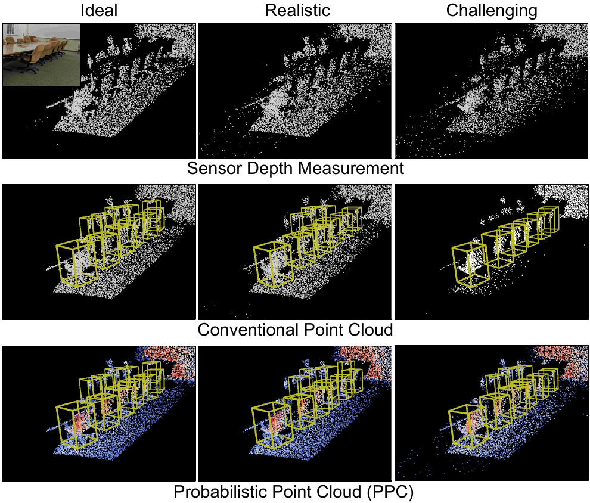

## Robust 3D Object Detection using Probabilistic Point Clouds

**Under Review**   [PDF](https://drive.google.com/file/d/1ErBsG4QKFJozsgoB9cveZU7j2PgNchWp) &nbsp; [Project](https://github.com/bhavyagoyal/ppc)

#### [Bhavya Goyal](https://bhavyagoyal.github.io), [Mohit Gupta](https://wisionlab.cs.wisc.edu/people/mohit-gupta/)
University of Wisconsin-Madison

### Abstract
LiDAR-based 3D sensors provide depth measurements for a scene with varying levels of confidence across pixels. This is due to different noise and signal levels encountered by different pixels in the raw sensor data. Conventional processing pipelines used to construct point clouds do not retain this information in the final point cloud output. Under non-ideal high noise conditions, downstream recognition on these point clouds is severely affected due to a large fraction of spurious points.

We propose to augment each point with a probability attribute that encapsulates this confidence value and construct a Probabilistic Point Cloud (PPC), which is fast and easy to compute. We also introduce methods to leverage PPC for robust recognition without adding any significant computational overhead. First, we propose Neighbor Probability Density (NPD) filtering based on the probability and spatial density of the points to mitigate background noise. Second, we propose a point sampling approach called Farthest Probable Point Sampling (FPPS) which is robust to the noise in point clouds. We show the effectiveness of our approach for 3D Object Detection on indoor SUN RGB-D dataset and outdoor KITTI dataset, as well as real Probabilistic Point Clouds captured using a LiDAR hardware prototype. Our complete recognition pipeline of constructing PPC followed by a 3D inference approach outperforms several baselines under a wide range of signal-to-background ratio (SBR) levels. The qualitative evaluation shows our method is more robust for small and distant objects that suffer from low SBR.

### Code

Coming Soon!

