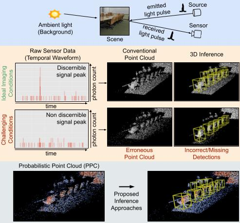

## Robust 3D Object Detection using Probabilistic Point Clouds from Single-Photon LiDARs

**ICCV 2025** <br> [Arxiv](https://arxiv.org/abs/2508.00169) &nbsp; [Project](https://bhavyagoyal.github.io/ppc)



#### [Bhavya Goyal](https://bhavyagoyal.github.io), [Felipe Gutierrez-Barragan](https://pages.cs.wisc.edu/~felipe/), [Wei Lin](https://www.linkedin.com/in/wei-lin-31a437108), [Andreas Velten](https://biostat.wisc.edu/~velten/), [Yin Li](https://www.biostat.wisc.edu/~yli/), [Mohit Gupta](https://wisionlab.cs.wisc.edu/people/mohit-gupta/)
University of Wisconsin-Madison


### Abstract
LiDAR-based 3D sensors provide point clouds, a canonical 3D representation used in various scene understanding tasks. Modern LiDARs face key challenges in several real-world scenarios, such as long-distance or low-albedo objects, producing sparse or erroneous point clouds. These errors, which are rooted in the noisy raw LiDAR measurements, get propagated to downstream perception models, resulting in potentially severe loss of accuracy. This is because conventional 3D processing pipelines do not retain any uncertainty information from the raw measurements when constructing point clouds.

We propose Probabilistic Point Clouds (PPC), a novel 3D scene representation where each point is augmented with a probability attribute that encapsulates the measurement uncertainty (or confidence) in the raw data. We further introduce inference approaches that leverage PPC for robust 3D object detection; these methods are versatile and can be used as computationally lightweight drop-in modules in 3D inference pipelines. We demonstrate, via both simulations and real captures, that PPC-based 3D inference methods outperform several baselines using LiDAR as well as camera-LiDAR fusion models, across challenging indoor and outdoor scenarios involving small, distant, and low-albedo objects, as well as strong ambient light.


<!-- ### Code Structure
```bash
.                                  # MMdetection3d Code
.
.
├── tools/ppc_simulation/          # Code for Probabilistic Point Cloud Simulation
└── README.md
``` -->

### Installation
Follow the [Installation](https://mmdetection3d.readthedocs.io/en/latest/get_started.html) steps for mmdetection3d framework. Or use my conda setup.
<details>
<summary>My conda setup</summary>

```bash
conda create -n openmmlab python=3.8
conda activate openmmlab
pip install torch==2.0.0 torchvision==0.15.1 torchaudio==2.0.1 --index-url https://download.pytorch.org/whl/cu118
pip install mmcv==2.0.1 -f  https://download.openmmlab.com/mmcv/dist/cu118/torch2.0.0/index.html
pip install mmdet==3.1.0
pip install -v -e .
```

</details>


### Dataset

Download and extract the [dataset](https://pages.cs.wisc.edu/~bhavya/ppcshared/data/sunrgbd/sunrgbd_points_ppc_1_100.tar.gz) (~12GB) file. Download the validation [labels](https://pages.cs.wisc.edu/~bhavya/ppcshared/data/sunrgbd/sunrgbd_infos_val.pkl) file. Use the following directory structure to organize the dataset.
```
.
.
└── data/          
|   └── sunrgbd/
|   |   └── sunrgbd_points_ppc/
|   |   |   └── sunrgbd_infos_val.pkl 
|   |   |   └── clean/
|   |   |   |   └── 0000001.bin
|   |   |   └── 1_100/
|   |   |   └── 1_50/
.
.
|   └── kitti/
|   |   └── kitti_points_ppc/
|   |   |   └── kitti_infos_val.pkl 
|   |   |   └── clean/
|   |   |   |   └── 0000000.bin
|   |   |   └── 5_1000/
.
.
```

If you need to evaluate on all SBR levels, you can download all `sunrgbd_points_ppc_*` files <a href="https://pages.cs.wisc.edu/~bhavya/ppcshared/data/sunrgbd/">here</a>.</summary>

<details>
<summary>If you need to simulate PPCs yourself using different simulation parameters, or evaluate on a different dataset, you can use my simulation scripts.</summary>


- Follow the original dataset [instructions](https://mmdetection3d.readthedocs.io/en/latest/user_guides/dataset_prepare.html) to prepare clean point cloud dataset.
- Use `ppc_simulate.sh` to simulate 3D temporal waveforms. `matlab` is required.

  ```bash
  cd tools/ppc_simulation
  ./ppc_simulate.sh 0 10
  ```

- Use `gen_points.sh` to create probabilistic point clouds from the 3D waveforms.
  ```bash
  ./gen_points.sh 0 10
  ```

- Use `create_pkl.py` to create label files for the whole dataset. 
  ```bash
  python create_pkl.py
  ```
- Convert clean point clouds to ppc by adding probability 1 attribute.
  ```bash
  python create_clean_ppc.py
  ```
- Edit the `dataset` field in the scripts to simulate for `KITTI` dataset. Increase 10 to the size of the dataset to simulate all scenes.

</details>


### Evaluation

Evaluate PPC model using `ppc_test_votenet.sh` script. 
```
./ppc_test_votenet.sh 1_100 <model_weights.pth>
```

Use `ppc_test_pvrcnn.sh` and `ppc_test_imvotenet.sh` for PV-RCNN and ImVoteNet evaluation. Uncomment lines in the scripts for baseline evaluations. 


### Training
Train PPC model using `ppc_train_votenet.sh` script. 
```bash
./ppc_train_votenet.sh
```
Uncomment lines in the scripts for baselines training. 


### Models

#####  VoteNet
Evaluated on SUN RGBD validation dataset.

|   Method           |          |          |  AP@25    |          |          |       Download      |
|-------------------:|:--------:|:--------:|:---------:|:--------:|:--------:|:-------------------:|
|                    |  *Clean* |    *0.1* |   *0.05*  |  *0.02*  |   *0.01* |                     |
|  Matched Filtering |   51.34  |   42.43  |   38.77   |  16.95   |   11.34  | [model](https://drive.google.com/file/d/1o_ADaNoi0Ws9a-2Lv7yFDQKHOakV-R0p/view?usp=sharing) \| [log](https://drive.google.com/file/d/1OkUKU9Tae6hF2kVSHcWVlU3YZH66P3gl/view?usp=sharing)|
|  Thresholding      |   57.11  |   51.27  |   46.44   |  29.58   |   16.47  | [model](https://drive.google.com/file/d/1LznG5jQZf_fAqyQJa6WvuyEzAsX0x-8j/view?usp=sharing) \| [log](https://drive.google.com/file/d/12rsry3ZbKyFZy9oXyXBcThLYHzYRTzzd/view?usp=sharing)|
|  **PPC**           | **58.61**| **54.29**| **52.46** |**38.49** | **29.42**| [model](https://drive.google.com/file/d/1AQ7r7k5UhbCmJpElhzA7NuKGJadN0n-E/view?usp=sharing) \| [log](https://drive.google.com/file/d/1Us8nX_4eYWnlkIJIhy9oswhQpxfHqBtK/view?usp=sharing)|

##### PV-RCNN
Pedestrian mAP for PV-RCNN (3 class) model. Evaluated on KITTI val split using 11 recall positions for moderate difficulty.

|   Method           |          |          |    mAP    |          |          |       Download      |
|-------------------:|:--------:|:--------:|:---------:|:--------:|:--------:|:-------------------:|
|                    |  *Clean* |   *0.05* |   *0.02*  |  *0.01*  | *0.005*  |                     |
|  Matched Filtering |   60.11  |   55.76  |   50.03   |  47.06   |   37.01  | [model](https://drive.google.com/file/d/15B42nZeFDY4xHpld-LVZbzmWmbX2mK2a/view?usp=sharing) \| [log](https://drive.google.com/file/d/1BD-5KTs7CZiJznhf9WlnQVWcjYWxf6jg/view?usp=sharing)|
|  Thresholding      |   61.62  |   57.72  |   54.80   |  49.23   |   38.62  | [model](https://drive.google.com/file/d/1PLpn1gwvWz_v3hsSYnBmxN4nJUNuiX3-/view?usp=sharing) \| [log](https://drive.google.com/file/d/136wx-lW16eI4ygjUiWYq44kaFYcNG5l8/view?usp=sharing)|
|  **PPC**           | 58.70 | **59.12**| **59.04** |**55.39** | **49.51**| [model](https://drive.google.com/file/d/1fZ9XK0ovlxivpyGn2-UHW6tSI6xtfE6D/view?usp=sharing) \| [log](https://drive.google.com/file/d/1jrz9QHhP0PtkLw_MFWudqRTBoon_YD7X/view?usp=sharing)|

<!---

##### Cyclist (3 class model)

|   Method           |          |          |    mAP    |          |          |       Download      |
|-------------------:|:--------:|:--------:|:---------:|:--------:|:--------:|:-------------------:|
|                    |  *Clean* |   *0.05* |   *0.02*  |  *0.01*  | *0.005*  |                     |
|  Matched Filtering |   71.11  |   63.31  |   57.25   |  50.25   |   40.90  | [model]() \| [log]()|
|  Thresholding      |   70.66  |   63.65  |   58.52   |  51.20   |   41.57  | [model]() \| [log]()|
|  [PPC]()           | **71.31**| **64.56**| **59.38** |**53.11** | **45.33**| [model]() \| [log]()|

-->

<!-- Model weights will be updated soon. -->

#####  ImVoteNet
Evaluated on SUN RGBD validation dataset.

|   Method           |          |          |  AP@25    |          |          |       Download      |
|-------------------:|:--------:|:--------:|:---------:|:--------:|:--------:|:-------------------:|
|                    |  *Clean* |    *0.1* |   *0.05*  |  *0.02*  |   *0.01* |                     |
|  Matched Filtering |   63.37   |   53.89  |   53.23   |  37.54   |   33.17  | [model](https://drive.google.com/file/d/1o_ADaNoi0Ws9a-2Lv7yFDQKHOakV-R0p/view?usp=sharing) \| [log](https://drive.google.com/file/d/1OkUKU9Tae6hF2kVSHcWVlU3YZH66P3gl/view?usp=sharing)|
|  Thresholding      |   64.25   |   59.57  |   58.82   |  42.43   |   39.51  | [model](https://drive.google.com/file/d/1LznG5jQZf_fAqyQJa6WvuyEzAsX0x-8j/view?usp=sharing) \| [log](https://drive.google.com/file/d/12rsry3ZbKyFZy9oXyXBcThLYHzYRTzzd/view?usp=sharing)|
|  **PPC**           | **64.36**| **61.51**| **60.19** |**53.21** | **46.84**| [model](https://drive.google.com/file/d/1AQ7r7k5UhbCmJpElhzA7NuKGJadN0n-E/view?usp=sharing) \| [log](https://drive.google.com/file/d/1Us8nX_4eYWnlkIJIhy9oswhQpxfHqBtK/view?usp=sharing)|

<br/><br/>

### Citation
```
@InProceedings{Goyal_2025_ICCV,
    author    = {Goyal, Bhavya and Gutierrez-Barragan, Felipe and Lin, Wei and Velten, Andreas and Li, Yin and Gupta, Mohit},
    title     = {Robust 3D Object Detection using Probabilistic Point Clouds from Single-Photon LiDARs},
    booktitle = {Proceedings of the IEEE/CVF International Conference on Computer Vision (ICCV)},
    month     = {October},
    year      = {2025},
    pages     = {28417-28427}
}
```

